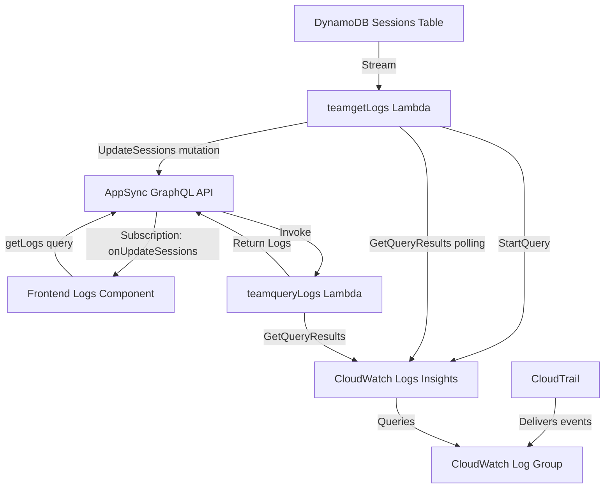
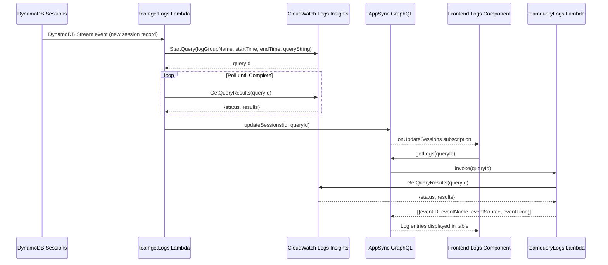
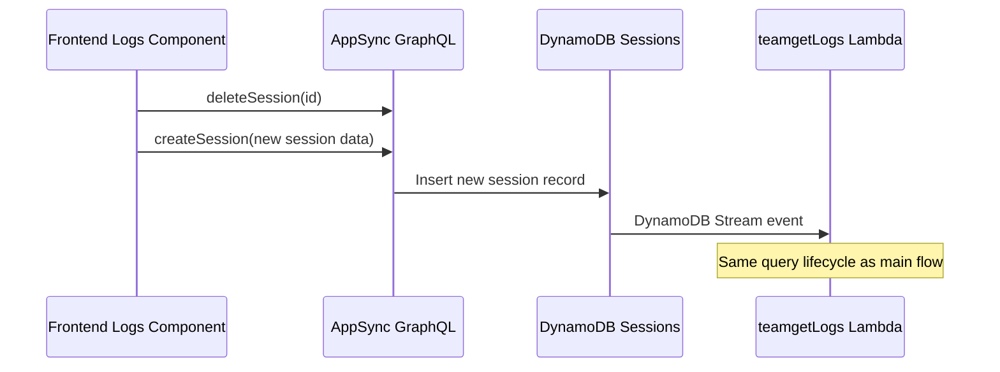

# Design Document: CloudWatch Session Logs Migration

## Overview

The session logs feature currently uses AWS CloudTrail Lake Event Data Store to query session activity logs. CloudTrail Lake is being sunset by AWS, and the recommended replacement is CloudWatch Logs Insights. This migration replaces the CloudTrail Lake query engine with CloudWatch Logs Insights while preserving the existing async query pattern (start query → poll → get results), the GraphQL API contract, and the frontend component behavior.

The core data flow remains the same: DynamoDB Stream triggers `teamgetLogs` Lambda which starts a query, polls for completion, and updates the Sessions table with a queryId. The frontend then calls `getLogs` GraphQL query which invokes `teamqueryLogs` Lambda to retrieve results. The key changes are the SDK client swap (`@aws-sdk/client-cloudtrail` → `@aws-sdk/client-cloudwatch-logs`), query syntax (SQL → CloudWatch Logs Insights query language), IAM policy updates, and environment variable changes (Event Data Store ARN → CloudWatch Log Group name).

A prerequisite for this migration is that CloudTrail is configured to deliver management events to a CloudWatch Log Group. This is the standard CloudTrail → CloudWatch Logs integration and is assumed to already exist or be configured separately.

## Architecture



## Sequence Diagrams

### Main Flow: Session Log Query Lifecycle



### Refresh Flow: In-Progress Session



## Components and Interfaces

### Component 1: teamgetLogs Lambda

**Purpose**: Triggered by DynamoDB Streams when a session record is created/updated. Starts a CloudWatch Logs Insights query, polls for completion, then updates the Sessions table with the queryId.

**Interface**:
```typescript
// Environment variables
interface TeamGetLogsEnv {
  REGION: string;
  CW_LOG_GROUP_NAME: string;  // was EVENT_DATA_STORE
  API_TEAM_GRAPHQLAPIENDPOINTOUTPUT: string;
}

// Handler input: DynamoDB Stream event
interface DynamoDBStreamEvent {
  Records: Array<{
    dynamodb: {
      NewImage: {
        id: { S: string };
        startTime: { S: string };
        endTime: { S: string };
        username: { S: string };
        accountId: { S: string };
        role: { S: string };
      };
    };
  }>;
}
```

**Responsibilities**:
- Parse session data from DynamoDB Stream event
- Construct CloudWatch Logs Insights query string
- Call `StartQuery` with log group name, time range, and query
- Poll `GetQueryResults` until status is `Complete`
- Update Sessions table with queryId via GraphQL mutation

### Component 2: teamqueryLogs Lambda

**Purpose**: Invoked by the `getLogs` GraphQL query. Retrieves query results from CloudWatch Logs Insights using a queryId.

**Interface**:
```typescript
// Environment variables
interface TeamQueryLogsEnv {
  REGION: string;
  // No longer needs EVENT_DATA_STORE / CW_LOG_GROUP_NAME
}

// Handler input: GraphQL resolver event
interface QueryLogsEvent {
  arguments: {
    queryId: string;
  };
}

// Return type
interface LogEntry {
  eventID: string;
  eventName: string;
  eventSource: string;
  eventTime: string;
}
```

**Responsibilities**:
- Accept queryId from GraphQL arguments
- Call CloudWatch Logs Insights `GetQueryResults` with queryId
- Transform results from CloudWatch field/value format to flat objects
- Return array of LogEntry objects matching the existing Logs GraphQL type

### Component 3: Backend Configuration (amplify/backend.ts)

**Purpose**: Defines IAM policies, environment variables, and DynamoDB Stream configuration for the Lambda functions.

**Changes**:
- Replace `cloudtrail:*` IAM actions with `logs:StartQuery`, `logs:GetQueryResults`, `logs:StopQuery`
- Update environment variable from `CLOUDTRAIL_AUDIT_LOGS` to `CW_LOG_GROUP_NAME`

### Component 4: Lambda Resource Definitions

**Purpose**: Define Lambda function configurations including environment variables.

**Changes**:
- `amplify/functions/teamgetLogs/resource.ts`: Replace `EVENT_DATA_STORE` env var with `CW_LOG_GROUP_NAME`
- `amplify/functions/teamqueryLogs/resource.ts`: Replace `EVENT_DATA_STORE` env var with `CW_LOG_GROUP_NAME` (or remove if not needed since `GetQueryResults` only needs queryId)

### Component 5: Deployment Parameters

**Purpose**: Shell script exporting environment variables for deployment.

**Changes**:
- Replace `CLOUDTRAIL_AUDIT_LOGS` with `CW_LOG_GROUP_NAME`

## Data Models

### CloudWatch Logs Insights Query String

The CloudTrail Lake SQL query:
```sql
SELECT eventID, eventName, eventSource, eventTime
FROM <EventDataStore>
WHERE eventTime > '<startTime>' AND eventTime < '<endTime>'
  AND lower(useridentity.principalId) LIKE '%:<username>%'
  AND useridentity.sessionContext.sessionIssuer.arn LIKE '%<role>%'
  AND recipientAccountId='<accountId>'
```

Becomes a CloudWatch Logs Insights query:
```
fields eventID, eventName, eventSource, eventTime
| filter eventTime > "<startTime>" and eventTime < "<endTime>"
| filter userIdentity.principalId like /(?i):<username>/
| filter userIdentity.sessionContext.sessionIssuer.arn like /<role>/
| filter recipientAccountId = "<accountId>"
| sort eventTime asc
```

**Note on time range filtering**: The `StartQuery` API accepts `startTime` and `endTime` as epoch-second parameters that scope which log data CloudWatch scans. The explicit `eventTime` filter in the query string provides an additional application-level filter on the CloudTrail event's own `eventTime` field, matching the original CloudTrail Lake SQL behavior. Both layers work together: the API parameters limit the log scan window, and the query filter ensures only events within the exact session time range are returned.

**Validation Rules**:
- `startTime` and `endTime` must be converted from ISO 8601 strings to Unix epoch seconds for the `StartQuery` API parameters
- `startTime` and `endTime` ISO 8601 strings are also embedded in the query string for the `eventTime` filter
- `username` must have the `idc_` prefix stripped (existing behavior preserved)
- `role` and `accountId` must be non-empty strings
- The log group name must reference a valid CloudWatch Log Group receiving CloudTrail events

### CloudWatch GetQueryResults Response Format

CloudWatch Logs Insights returns results in a different format than CloudTrail Lake:

```typescript
// CloudWatch Logs Insights result format
interface CWQueryResult {
  status: 'Scheduled' | 'Running' | 'Complete' | 'Failed' | 'Cancelled' | 'Timeout' | 'Unknown';
  results: Array<Array<{
    field: string;  // e.g., "eventID", "eventName"
    value: string;  // the actual value
  }>>;
}

// Must be transformed to match existing Logs GraphQL type
interface LogEntry {
  eventID: string;
  eventName: string;
  eventSource: string;
  eventTime: string;
}
```

### Existing GraphQL Types (Unchanged)

```graphql
type Logs {
  eventName: String
  eventSource: String
  eventID: String
  eventTime: String
}

type sessions {
  id: String!
  startTime: String
  endTime: String
  username: String
  accountId: String
  role: String
  approver_ids: [String]
  queryId: String
  expireAt: AWSTimestamp
}
```

## Key Functions with Formal Specifications

### Function 1: startQuery (teamgetLogs)

```javascript
async function startQuery(event) {
  // event: DynamoDB Stream NewImage record
  // Returns: string (queryId)
}
```

**Preconditions:**
- `event` contains valid `startTime`, `endTime`, `username`, `accountId`, `role` fields
- `startTime` and `endTime` are valid ISO 8601 datetime strings
- `CW_LOG_GROUP_NAME` environment variable is set and references a valid CloudWatch Log Group
- The CloudWatch Log Group receives CloudTrail management events

**Postconditions:**
- Returns a valid queryId string from CloudWatch Logs Insights
- The query is scoped to the correct time range, username, role, and account
- No side effects on the input event data

### Function 2: getQueryStatus (teamgetLogs)

```javascript
async function getQueryStatus(queryId) {
  // queryId: string
  // Returns: { status: string, results: Array }
}
```

**Preconditions:**
- `queryId` is a valid CloudWatch Logs Insights query ID
- The query was previously started via `StartQuery`

**Postconditions:**
- Returns an object with `status` field indicating query state
- Status is one of: `Scheduled`, `Running`, `Complete`, `Failed`, `Cancelled`, `Timeout`, `Unknown`
- When status is `Complete`, results are available

### Function 3: getQueryResults (teamqueryLogs)

```javascript
async function getQueryResults(queryId) {
  // queryId: string
  // Returns: Array<LogEntry>
}
```

**Preconditions:**
- `queryId` is a valid CloudWatch Logs Insights query ID
- The query has reached `Complete` status

**Postconditions:**
- Returns an array of `LogEntry` objects with `eventID`, `eventName`, `eventSource`, `eventTime` fields
- Each result row from CloudWatch is transformed from `[{field, value}]` format to flat `{key: value}` objects
- The `@ptr` and `@timestamp` internal CloudWatch fields are excluded from the output
- Empty results return an empty array (not null/undefined)

### Function 4: buildQueryString

```javascript
function buildQueryString(startTime, endTime, username, role, accountId) {
  // Returns: string (CloudWatch Logs Insights query)
}
```

**Preconditions:**
- `startTime` is a valid ISO 8601 datetime string
- `endTime` is a valid ISO 8601 datetime string where `endTime > startTime`
- `username` is a non-empty string with `idc_` prefix already stripped
- `role` is a non-empty string (IAM role ARN fragment)
- `accountId` is a non-empty string (12-digit AWS account ID)

**Postconditions:**
- Returns a valid CloudWatch Logs Insights query string
- Query selects `eventID`, `eventName`, `eventSource`, `eventTime`
- Query filters by `eventTime` greater than `startTime` and less than `endTime`
- Query filters by `userIdentity.principalId` containing the username (case-insensitive)
- Query filters by `userIdentity.sessionContext.sessionIssuer.arn` containing the role
- Query filters by `recipientAccountId` matching the accountId exactly
- Query sorts results by `eventTime` ascending

**Loop Invariants:** N/A

## Algorithmic Pseudocode

### teamgetLogs Handler Algorithm

```javascript
// ALGORITHM: teamgetLogs handler
// INPUT: DynamoDB Stream event with session record
// OUTPUT: GraphQL mutation response updating Sessions with queryId

async function handler(event) {
  // Step 1: Extract session data from DynamoDB Stream
  const record = event.Records[event.Records.length - 1];
  const data = record.dynamodb.NewImage;
  const id = data.id.S;
  const startTime = data.startTime.S;
  const endTime = data.endTime.S;
  const username = data.username.S.replace('idc_', '');
  const accountId = data.accountId.S;
  const role = data.role.S;

  // Step 2: Convert ISO timestamps to epoch seconds
  const startEpoch = Math.floor(new Date(startTime).getTime() / 1000);
  const endEpoch = Math.floor(new Date(endTime).getTime() / 1000);

  // Step 3: Build CloudWatch Logs Insights query
  const queryString = buildQueryString(startTime, endTime, username, role, accountId);

  // Step 4: Start the query
  const cwClient = new CloudWatchLogsClient({ region: REGION });
  const startResponse = await cwClient.send(new StartQueryCommand({
    logGroupName: CW_LOG_GROUP_NAME,
    startTime: startEpoch,
    endTime: endEpoch,
    queryString: queryString,
  }));
  const queryId = startResponse.queryId;

  // Step 5: Poll until query completes
  // LOOP INVARIANT: queryId is valid and query has not been cancelled
  let status = 'Running';
  while (status === 'Running' || status === 'Scheduled') {
    const getResponse = await cwClient.send(new GetQueryResultsCommand({
      queryId: queryId,
    }));
    status = getResponse.status;

    if (status === 'Complete') {
      // Step 6: Update Sessions table with queryId
      const response = await updateItem(id, queryId);
      return response;
    }

    if (status === 'Failed' || status === 'Cancelled' || status === 'Timeout') {
      throw new Error(`Query failed with status: ${status}`);
    }

    // Brief pause before next poll
    await new Promise(resolve => setTimeout(resolve, 1000));
  }
}
```

### teamqueryLogs Handler Algorithm

```javascript
// ALGORITHM: teamqueryLogs handler
// INPUT: GraphQL event with queryId argument
// OUTPUT: Array of LogEntry objects

async function handler(event) {
  const queryId = event.arguments.queryId;

  // Step 1: Get query results from CloudWatch Logs Insights
  const cwClient = new CloudWatchLogsClient({ region: REGION });
  const response = await cwClient.send(new GetQueryResultsCommand({
    queryId: queryId,
  }));

  // Step 2: Transform CloudWatch result format to flat objects
  // CloudWatch returns: [[{field: "eventID", value: "abc"}, {field: "eventName", value: "xyz"}], ...]
  // We need: [{eventID: "abc", eventName: "xyz"}, ...]
  const output = [];
  if (response.results) {
    for (const row of response.results) {
      const logEntry = {};
      for (const fieldValue of row) {
        // Skip internal CloudWatch fields
        if (fieldValue.field.startsWith('@')) continue;
        logEntry[fieldValue.field] = fieldValue.value;
      }
      output.push(logEntry);
    }
  }

  return output;
}
```

## Example Usage

### Starting a CloudWatch Logs Insights Query

```javascript
import {
  CloudWatchLogsClient,
  StartQueryCommand,
  GetQueryResultsCommand,
} from "@aws-sdk/client-cloudwatch-logs";

const client = new CloudWatchLogsClient({ region: "us-east-2" });

// Start query
const startResponse = await client.send(new StartQueryCommand({
  logGroupName: "aws-cloudtrail-logs-985539781022",
  startTime: Math.floor(new Date("2024-01-01T00:00:00Z").getTime() / 1000),
  endTime: Math.floor(new Date("2024-01-02T00:00:00Z").getTime() / 1000),
  queryString: `fields eventID, eventName, eventSource, eventTime
    | filter eventTime > "2024-01-01T00:00:00Z" and eventTime < "2024-01-02T00:00:00Z"
    | filter userIdentity.principalId like /(?i):johndoe/
    | filter userIdentity.sessionContext.sessionIssuer.arn like /AWSReservedSSO_AdminAccess/
    | filter recipientAccountId = "123456789012"
    | sort eventTime asc`,
}));

// Get results
const results = await client.send(new GetQueryResultsCommand({
  queryId: startResponse.queryId,
}));
// results.status: "Complete"
// results.results: [[{field: "eventID", value: "..."}, ...], ...]
```

### Transforming CloudWatch Results to Match Existing GraphQL Type

```javascript
// CloudWatch Logs Insights returns:
const cwResults = [
  [
    { field: "eventID", value: "abc-123" },
    { field: "eventName", value: "AssumeRole" },
    { field: "eventSource", value: "sts.amazonaws.com" },
    { field: "eventTime", value: "2024-01-01T12:00:00Z" },
    { field: "@ptr", value: "internal-pointer" },
  ],
];

// Transform to match existing Logs type:
const logs = cwResults.map(row => {
  const entry = {};
  for (const { field, value } of row) {
    if (!field.startsWith('@')) {
      entry[field] = value;
    }
  }
  return entry;
});
// Result: [{ eventID: "abc-123", eventName: "AssumeRole", eventSource: "sts.amazonaws.com", eventTime: "2024-01-01T12:00:00Z" }]
```

## Correctness Properties

*A property is a characteristic or behavior that should hold true across all valid executions of a system — essentially, a formal statement about what the system should do. Properties serve as the bridge between human-readable specifications and machine-verifiable correctness guarantees.*

### Property 1: Timestamp conversion preserves order

*For any* pair of valid ISO 8601 datetime strings where startTime < endTime, converting both to Unix epoch seconds SHALL produce startEpoch < endEpoch, and both values SHALL be non-negative integers.

**Validates: Requirement 1.3**

### Property 2: Query builder produces correct CloudWatch Logs Insights query

*For any* valid combination of startTime, endTime, username, role, and accountId, the Query_Builder SHALL produce a query string that: (a) selects exactly `eventID`, `eventName`, `eventSource`, `eventTime`; (b) filters `eventTime` between startTime and endTime; (c) filters `userIdentity.principalId` with a case-insensitive match containing the username (with `idc_` prefix stripped); (d) filters `userIdentity.sessionContext.sessionIssuer.arn` containing the role; (e) filters `recipientAccountId` matching the accountId exactly; and (f) sorts by `eventTime` ascending.

**Validates: Requirements 2.1, 2.2, 2.3, 2.4, 2.5, 2.6, 2.7**

### Property 3: Result transformation excludes internal fields and preserves data

*For any* CloudWatch Logs Insights result array (including empty arrays), the Result_Transformer SHALL produce an array of flat objects where: (a) each field/value pair becomes a key/value entry in the object; (b) no key starts with `@`; and (c) empty input produces an empty array.

**Validates: Requirements 5.1, 5.2, 5.3, 5.4, 8.4**

### Property 4: Sessions table mutation occurs only after query completion

*For any* sequence of polling responses from `GetQueryResults`, the teamgetLogs_Lambda SHALL invoke the `updateSessions` GraphQL mutation only when the query status is `Complete`, and SHALL never invoke it when the status is `Scheduled`, `Running`, `Failed`, `Cancelled`, or `Timeout`.

**Validates: Requirements 3.1, 3.2, 3.4**

## Error Handling

### Error Scenario 1: Query Fails

**Condition**: CloudWatch Logs Insights query returns status `Failed`, `Cancelled`, or `Timeout`
**Response**: Log the error with queryId and status. Throw an error to surface the failure.
**Recovery**: The DynamoDB Stream retry policy (up to 3 retries) will re-trigger the Lambda. If the query consistently fails, the session record will not have a queryId, and the frontend will show the loading state.

### Error Scenario 2: Invalid Log Group Name

**Condition**: `CW_LOG_GROUP_NAME` references a non-existent CloudWatch Log Group
**Response**: `StartQuery` throws `ResourceNotFoundException`
**Recovery**: Deployment validation should verify the log group exists. The error is logged and the Lambda invocation fails, triggering DynamoDB Stream retries.

### Error Scenario 3: Query Results Retrieved Before Completion

**Condition**: `teamqueryLogs` is called with a queryId whose query is still `Running`
**Response**: `GetQueryResults` returns partial results with status `Running`
**Recovery**: This should not happen in normal flow since `teamgetLogs` only writes the queryId after the query reaches `Complete`. If it does occur, the frontend receives partial/empty results and can refresh.

### Error Scenario 4: Lambda Timeout During Polling

**Condition**: The CloudWatch Logs Insights query takes longer than the Lambda timeout (20s) to complete
**Response**: Lambda times out, DynamoDB Stream retries the event
**Recovery**: On retry, a new query is started. Consider increasing Lambda timeout if queries consistently take longer. CloudWatch Logs Insights queries typically complete faster than CloudTrail Lake queries.

### Error Scenario 5: CloudWatch Logs Insights Query Limit

**Condition**: CloudWatch Logs Insights has a limit of 30 concurrent queries per account per region
**Response**: `StartQuery` throws `LimitExceededException`
**Recovery**: DynamoDB Stream retry with exponential backoff handles transient limit issues. For sustained high volume, consider implementing a queue or rate limiting.

## Testing Strategy

### Unit Testing Approach

- Test `buildQueryString` function with various username, role, and accountId inputs to verify correct query construction
- Test the CloudWatch result transformation logic (field/value array → flat object) with various result shapes including empty results, results with `@ptr`/`@timestamp` fields, and missing fields
- Test timestamp conversion from ISO 8601 to epoch seconds
- Mock `CloudWatchLogsClient` to test the polling logic in `teamgetLogs` with different status sequences (e.g., Running → Running → Complete, Running → Failed)
- Test the `teamqueryLogs` handler with mocked `GetQueryResults` responses

### Property-Based Testing Approach

**Property Test Library**: fast-check

- For any valid ISO 8601 timestamp pair where start < end, the epoch conversion should produce `startEpoch < endEpoch`
- For any CloudWatch result array, the transformation should produce objects with no `@`-prefixed keys
- For any username string, the generated query should contain a case-insensitive filter pattern

### Integration Testing Approach

- Deploy to a test environment with a real CloudWatch Log Group receiving CloudTrail events
- Create a session record in DynamoDB and verify the full flow: Stream trigger → query start → poll → Sessions update → frontend retrieval
- Verify that the returned log entries match expected CloudTrail events for the given time range and filters

## Performance Considerations

- CloudWatch Logs Insights queries typically return faster than CloudTrail Lake queries, especially for recent data
- CloudWatch Logs Insights has a limit of 30 concurrent queries per account per region (vs CloudTrail Lake's 5 concurrent queries) — this is an improvement
- The `GetQueryResults` API returns up to 10,000 results by default with no pagination needed for most session log queries (CloudTrail Lake required pagination via `paginateGetQueryResults`)
- The polling interval (1 second) is appropriate for CloudWatch Logs Insights query completion times
- Lambda timeout of 20 seconds should be sufficient; CloudWatch Logs Insights queries over small time ranges typically complete in 1-5 seconds

## Security Considerations

- IAM policies follow least privilege: only `logs:StartQuery`, `logs:GetQueryResults`, `logs:StopQuery` are granted
- The CloudWatch Log Group name is passed via environment variable, not hardcoded
- Query string construction should sanitize the username, role, and accountId inputs to prevent query injection (CloudWatch Logs Insights query language has limited injection surface, but input validation is still good practice)
- The existing SigV4-signed GraphQL mutation for updating Sessions remains unchanged
- No changes to authentication/authorization model — the same Cognito user pool and IAM roles are used

## Dependencies

- `@aws-sdk/client-cloudwatch-logs` — replaces `@aws-sdk/client-cloudtrail` in both Lambda functions
- Existing dependencies remain unchanged:
  - `@aws-crypto/sha256-js` (SigV4 signing in teamgetLogs)
  - `@aws-sdk/credential-provider-node` (SigV4 signing)
  - `@aws-sdk/signature-v4` (SigV4 signing)
  - `@aws-sdk/protocol-http` (SigV4 signing)
  - `node-fetch` (GraphQL mutation in teamgetLogs)
- Infrastructure prerequisite: A CloudWatch Log Group configured to receive CloudTrail management events (standard CloudTrail → CloudWatch Logs integration)
- `deployment/parameters.sh` must export `CW_LOG_GROUP_NAME` with the CloudWatch Log Group name
